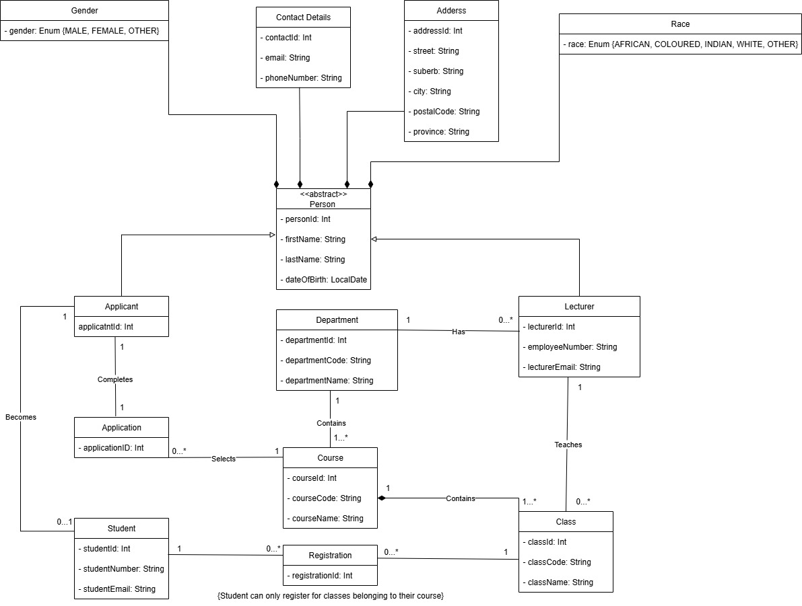

# ADP372S Capstone Project – Student Registration System Backend

## Overview
This project was developed by our group as part of the ADP372S Capstone Project.

The goal of this backend is to support a Student Registration System that simulates the registration process of a student. This project continues from our earlier Student Registration System work, but this version uses **Spring Boot, REST APIs, Spring Data JPA and MySQL**.

This repository focuses only on the **backend** of the system. The desktop frontend will be developed separately.

## UML Class Diagram
Below is the UML class diagram used to design the backend and define the relationships between the main entities.

## Domain
The main domain classes include:

- Person
- Applicant
- Student
- Lecturer
- Department
- Course
- Class
- Application
- Registration
- Address
- ContactDetails
- Gender
- Race

## Backend Structure
The backend follows a layered structure consisting of:

- **Domain** – contains the main entities
- **Factory** – creates and validates domain objects
- **Repository** – handles database access using Spring Data JPA
- **Service** – contains the business logic
- **Controller** – provides REST API endpoints
- **Util** – contains reusable helper methods

## Main System Flow
The system allows:

- Departments to be created
- Courses to be created under departments
- Classes to be created under courses
- Lecturers to be assigned to departments
- Lecturers to choose available classes within their department
- Applicants to apply for a course
- Students to be created from applicants
- Students to register for classes that belong to their course

## Technologies Used
- Java
- Spring Boot
- Spring Data JPA
- REST APIs
- MySQL
- MySQL Workbench
- Maven
- JUnit
- Postman
- Git and GitHub

## Testing
The backend includes tests for the factory, repository, service and controller layers using **JUnit**.

Postman is also used to test the REST API flow and confirm that the backend behaves according to the UML and business rules.

## Authors
- **DAMIEN NOLAN SWARTS** (222868791)
- **CHRISTIAN HAKIZIMANA** (219117675)
- **SIPHAMANDLA CHULUMANCO TSHIJILA** (231070071)